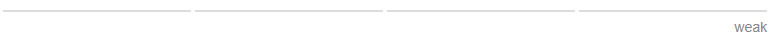
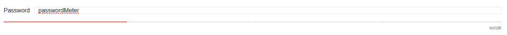

# Overview

This component uses the react-password-strength-bar library to display a color-coded password strength indicator with real-time feedback. It helps users create stronger passwords by labeling strength levels.
In Qodly, you can easily integrate this component below a text input and bind it to the same qodlysource, allowing you to dynamically check and display the password strength as the user types.

## Password strength meter

### Password strength meter with text input

# QodlySource

| Name        | Type   | Required | Description                                      |
| ----------- | ------ | -------- | ------------------------------------------------ |
| Qodlysource | string | Yes      | Will contain the password that will be evaluated |

# Properties

| Name       | Type   | Default | Description                             |
| ---------- | ------ | ------- | --------------------------------------- |
| Min length | number | 4       | The min length of the inputted password |
